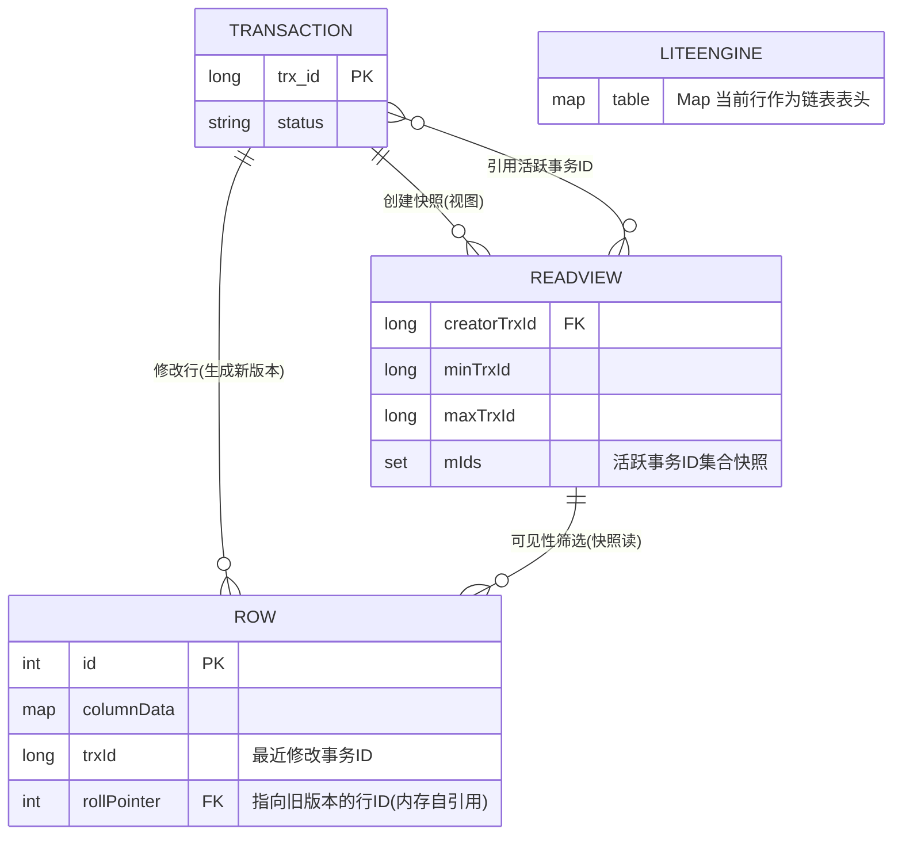
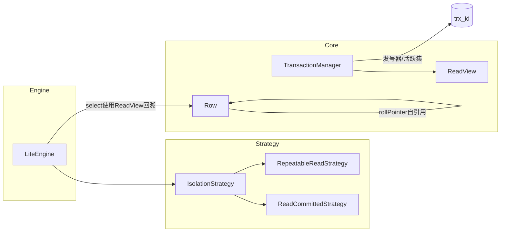
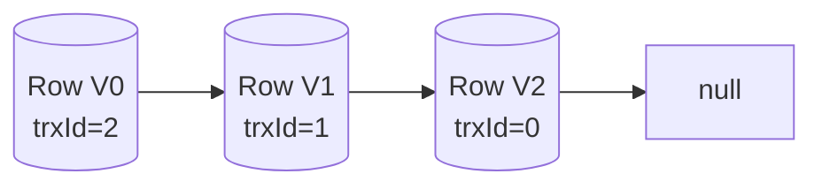

# Java-Lite-MVCC 关系图与架构图

## ER 关系图（数据视角）

说明
- READVIEW.mIds 是“生成时刻”的活跃事务ID集合快照，用于可见性判断
- ROW.rollPointer 构成 Undo Log 链；LITEENGINE.table 的每个 id 对应“链表表头”（最新版本）

## 架构关系（类与依赖）

要点
- LiteEngine 通过 IsolationStrategy 获取 ReadView（RC 每次新建，RR 复用首次）
- ReadView 使用 TransactionManager 的活跃集与发号器边界进行可见性判断
- Row 自引用形成版本链；select 顺链回溯到可见版本

## 版本链（Undo Log 可视化）

关联代码
- 事务管理与活跃集：TransactionManager.java
- 读视图与可见性：ReadView.java
- 行对象与隐藏列：Row.java
- 引擎读写与链回溯：LiteEngine.java
